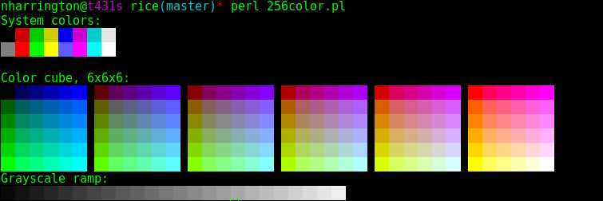

Open your terminal, issue the command:

Install prerequisites:

    $ dnf install lua htop

Configure gnome-terminal

    Set the color scheme to (built-in) Green on Black
    Set the color palette to xterm

    $ perl 256color.pl

    You're looking for an image like this:
    
    
    If all of the colors are visible, continue. Otherwise, you may need to
    change your find a suitable 256-color terminal.

Install tmux from source. This may not be neccessary, but it is tested

    $ git clone https://github.com/tmux/tmux/wiki
    $ ./configure && make
    $ make install

Install cli-visualizer

    $ dnf install fftw-devel ncurses-devel pulseaudio-libs-devel
    $ git clone https://github.com/dpayne/cli-visualizer
    $ ./install.sh
    $ vis
    (Verify the bars are moving while playing audio, q to exit)

Install and verify cmatrix:

    $ git clone https://github.com/abishekvashok/cmatrix
    $ autoreconf -i
    $ make install
    $ cmatrix
    (ctrl-c to exit)

Verify sppoky:

    $ lua 3spooky.lua 
    (Press ctrl-Z to stop, then pkill lua to terminate)

Verify hack.exe
    
    $ ./hack.exe
    (Type 'exit' to stop, then ctrl-c to terminate)

Verify hack.exe
    
    $ ./hack.exe
    (Type 'exit' to stop, then ctrl-c to terminate)

Verify pipes.sh

    $ ./pipes.sh
    (Control-C to exit)
    # If you want pipes like that shown in the animated gif, you'll need
    # to install from: https://github.com/pipeseroni/pipes.sh

Configure htop:

    $ htop
    (Press F2, In Left column, deltet CPUs (1/1) [Bar]
     Add CPU average from available meters to left bar, it will change
     it's name to just CPU [Bar])

